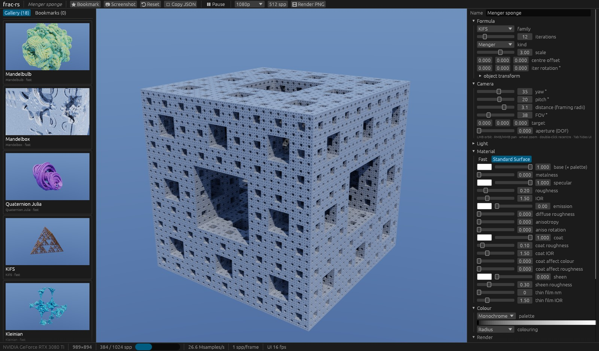
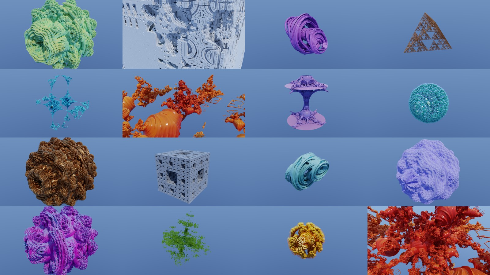

# frac-rs

A browser for path-traced 3D fractals. The GPU kernels are **Rust compiled straight to PTX** by
NVIDIA's [cuda-oxide](https://github.com/NVlabs/cuda-oxide) rustc backend. There is no CUDA C++,
no WGSL and no DSL: host code and kernels live in the same crate and are built in a single
`cargo oxide build`. The UI is [egui](https://github.com/emilk/egui).



## What it does

- **Eight distance-estimated families:** Mandelbulb (Mandelbrot or Julia form, angle scales,
  phases and per-iteration rotation), Mandelbox, quaternion Julia (a rotated 4D slice), KIFS
  (tetrahedron, octahedron, Menger), Kleinian, pseudo-Kleinian, Apollonian, and Hybrid (up to
  four bulb / box / KIFS-fold / inversion steps, repeated).
- **Unidirectional path tracing:** sun-cone and gradient-sky next-event estimation, MIS with the
  power heuristic, and Russian roulette. A thin-lens camera gives depth of field.
- **Two material models**, each compiled as its own set of kernels:
  - *Fast*: Lambert plus GGX.
  - *Standard Surface*: the full Autodesk Standard Surface (MaterialX port) with coat, sheen,
    thin film and anisotropy. The [`standard-surface-bsdf`](vendor/standard-surface-bsdf) crate
    is called directly from the kernel.
- **14 palettes** and orbit-trap colouring (origin, plane, point).
- **The browser:**
  - an 18-preset gallery with GPU-rendered thumbnails;
  - bookmarks (scenes saved as JSON);
  - an inspector for every parameter;
  - a progressive viewport that switches to a half-resolution, 2-bounce preview while you drag;
  - screenshots;
  - final PNG renders up to 4K.



## Origin

frac-rs is a CUDA port of `ofx-fractal`, the fractal engine of the ofx-rs OpenFX plug-ins
(WGPU/WGSL):

| ofx-rs / render-rs | frac-rs |
|---|---|
| `fractal3d.wgsl`: estimates, march, normals, palette, sky | `src/gpu.rs` |
| `pathtrace.wgsl` + render-rs `pt-integrator` | `src/gpu.rs`, `trace_path` |
| `fractal3d.rs`: presets, `Frames`, `max_distance`, footprint | `src/scene.rs` |
| `uniform3d.rs`: the uniform layout | `src/params.rs` |
| `ofx-gen/palette.rs` | `src/palette.rs` |
| render-rs `standard-surface-bsdf` | `vendor/standard-surface-bsdf` (used unchanged, except `libm::*` → `f32` methods) |

## Requirements

- An NVIDIA GPU (developed on an RTX 3080 Ti, `sm_86`) on Linux or WSL2.
  - On WSL2, install only the CUDA **toolkit**; the driver comes from Windows. Never install
    `cuda-drivers` or `nvidia-driver-*` inside WSL.
- CUDA Toolkit 13.x, LLVM/`llc` 21 or newer, and clang (for bindgen).
- The pinned nightly `nightly-2026-08-28` (see `rust-toolchain.toml`).
- `cargo-oxide`:
  ```sh
  cargo +nightly-2026-08-28 install --git https://github.com/NVlabs/cuda-oxide.git cargo-oxide
  cargo oxide doctor
  ```

## Build and run

```sh
export CUDA_HOME=/usr/local/cuda CUDA_OXIDE_LLC=/usr/bin/llc-22
cargo oxide run                                         # the browser
./target/release/frac-rs --gallery out 1920 1080 256    # every preset to out/*.png
./target/release/frac-rs --bench 960 540 32             # timing table
```

**Controls:**

| input | action |
|---|---|
| left drag | orbit |
| right or middle drag | pan |
| wheel | zoom |
| double-click | recentre |
| `Tab` | hide the panels |
| `Space` | pause |

Bookmarks are stored in `~/.local/share/frac-rs/bookmarks`. Screenshots and renders go to
`~/Pictures/frac-rs`.

## Performance

These numbers are from an RTX 3080 Ti, 1280×720, 6 bounces, at the preset views (`--bench`;
the full table is in [docs/bench-1280x720.txt](docs/bench-1280x720.txt)):

| preset | ms / spp | Msamples/s |
|---|---:|---:|
| KIFS (tetrahedron) | 5.2 | 177 |
| Octahedron KIFS | 8.6 | 107 |
| Quaternion Julia | 12.6 | 73 |
| Apollonian | 12.2 | 76 |
| Kleinian | 13.3 | 69 |
| Mandelbulb | 35.4 | 26 |
| Menger sponge, Standard Surface | 20.0 | 46 |
| Mandelbulb power 12, gold, Standard Surface | 69.2 | 13 |

**What makes it fast:**

- **One kernel per (family, material model).** Both are const generics, so each of the 16
  kernels contains only its own estimate and its own BSDF. There is no runtime dispatch, and the
  kernels need fewer registers. All device functions are force-inlined, so there are no ABI
  spills.
- **Parameters in `#[constant]` memory.** Every lane reads the same slot, so the value is
  broadcast to the whole warp.
- **Bounding-sphere ray clipping.** Rays march only inside the escape radius or ball bound. This
  is exact: outside it the estimate is "outside" anyway. Without it, every camera and escaping
  bounce ray spent about 40 capped steps crossing empty space.
- **A trig-free power-8 Mandelbulb.** Three angle doublings replace `acos`/`atan2`/`pow`.
- **Step factor 0.85** (ofx-fractal uses 0.5). On the presets it measured unbiased (mean
  luminance unchanged) and is 1.5× faster. A slider brings back 0.5.
- **8×4 pixel tiles per warp,** so neighbouring rays share their march paths.
- **Only RGBA8 leaves the GPU.** Accumulation and tonemapping (ACES or Reinhard, exposure,
  saturation) run on the GPU. Changing the tonemap re-tonemaps without restarting the samples.

Under WSL2 the frame still makes one device-to-host copy. CUDA↔GL interop is not available
there (WSLg is Mesa d3d12).

## Layout

```text
src/gpu.rs        the kernels (#[cuda_module]): estimates, march, normals, lighting, integrator, tonemap
src/scene.rs      Scene (serde), formulas, presets, gallery, packing into the parameter block
src/params.rs     parameter-block slots shared by host and device
src/render.rs     CUDA context, progressive targets, kernel dispatch, PNG output
src/app.rs        the egui browser
src/palette.rs    the 14 palettes
vendor/standard-surface-bsdf   Autodesk Standard Surface (MaterialX port, Apache-2.0, see its NOTICE)
```

## Licences

`vendor/standard-surface-bsdf` is a derivative of MaterialX (Apache-2.0); see its `LICENSE` and
`NOTICE`. The fractal formulas credit their sources in the ofx-rs code they were ported from
(Knighty's KIFS, Leys' Kleinian, Mandelbulber's pseudo-Kleinian, and others).
