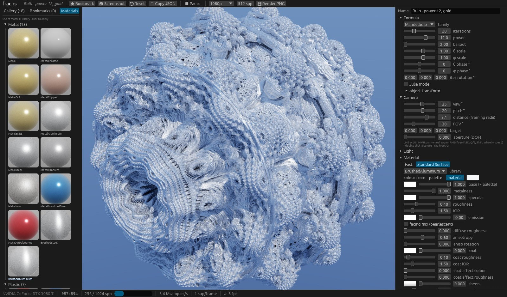

# frac-rs

A browser for path-traced 3D fractals. The tracing kernels are **Rust compiled straight to PTX** by
NVIDIA's [cuda-oxide](https://github.com/NVlabs/cuda-oxide) rustc backend. The tracer uses no CUDA C++
or shader DSL: host code and tracing kernels live in the same crate and are built in a single
`cargo oxide build`. The UI is [egui](https://github.com/emilk/egui).


## What it does

- **Eight distance-estimated families:** Mandelbulb (Mandelbrot or Julia form, angle scales,
  phases and per-iteration rotation), Mandelbox, quaternion Julia (a rotated 4D slice), KIFS
  (tetrahedron, octahedron, Menger), Kleinian, pseudo-Kleinian, Apollonian, and Hybrid (up to
  four bulb / box / KIFS-fold / inversion steps, repeated).
- **World objects:** Playa UUID nodes for fractals, cameras, directional lights, HDR environments,
  groups and materials, with parent transforms, visibility, layer spans, lock and solo.
  Multiple fractals take part in primary rays, shadows and reflections; multiple directional
  lights and one active HDR/EXR environment illuminate the same world.
- **Object animation:** an Outliner, Attribute Editor and AE-style Timeline share selection and
  transactional undo/redo. Numeric components and discrete properties use Playa animation.
- **Unidirectional path tracing:** sun-cone, sky and HDR next-event estimation, MIS with the
  power heuristic, and Russian roulette. A thin-lens camera gives depth of field.
- **GPU OIDN:** periodic scene-linear HDR denoising with primary-hit albedo/normal guides,
  followed by exposure and the display transform. Raw samples remain available.
- **Two material models**, supported by both the world tracer and legacy specialized kernels:
  - *Fast*: Lambert plus GGX.
  - *Standard Surface*: the full Autodesk Standard Surface (MaterialX port) with coat, sheen,
    thin film and anisotropy. The [`standard-surface-bsdf`](https://github.com/ssoj13/render-rs/tree/13c757e45aecc490352bc82ebd5de6ce2e234274) crate
    is called directly from the kernel.
- **14 palettes** and orbit-trap colouring (origin, plane, point).
- **Material library:** the 50 curated presets of usd-rs `usd-mat-lib` in 12 categories (metals,
  brushed metals, plastics, car paint, ceramic, stone, wood, leather, velvet and fabric, rubber,
  paper, glass, emissive), each shown as a GPU-rendered sphere swatch.
  - Presets are translated the way usd-rs `usd-hd-pt` maps UsdPreviewSurface to Standard
    Surface. Sheen (velvet) and anisotropy (brushed metal) select the Standard Surface kernels.
  - The `pt-material-ext` facing mix (pearlescent, oil slick) works in both models.
  - The fractal colour comes from either the palette or the material.
  - Glass renders opaque: a distance-estimated fractal has no interior to refract through, so
    glass becomes a clear-coated smooth dielectric.
- **Unreal-style flight:** hold the right mouse button in the viewport to fly.
  - The mouse looks around; WASD moves; R/C moves up/down; Q/E rolls and enables free flight;
    Shift boosts; the wheel sets the speed.
  - It uses `cam-controls` `SpaceFlight` with FPS damping and a level horizon.
    The shared crate's opt-in `inertial-look` feature provides damped mouse-look.
  - When you release the button, the orbit pivot sits in front of the camera, so orbiting
    continues from where you flew.
  - Backtick / tilde switches between a level horizon and free flight. In free flight,
    Q/E rolls and R/C moves up/down; all six flight axes have damped inertia. Roll and mode
    are saved with the camera and survive releasing RMB.
  - H restores the loaded preset/bookmark's camera; F frames the fractal's declared bounds
    (or a 10×10×10 box), including object scale/offset/rotation.
  - Settings → Controls adjusts mouse sensitivity and flight speed, saved between runs.
- **The browser:**
  - an 18-preset gallery with GPU-rendered thumbnails;
  - bookmarks (scenes saved as JSON);
  - an Attribute Editor for object parameters;
  - a progressive viewport that switches to a half-resolution, 2-bounce preview while you drag;
  - screenshots;
  - final PNG renders up to 4K.




## Origin

frac-rs is a CUDA port of `ofx-fractal`, the fractal engine of the ofx-rs OpenFX plug-ins
(WGPU/WGSL):

| ofx-rs / render-rs | frac-rs |
|---|---|
| `fractal3d.wgsl`: estimates, march, normals, palette, sky | `src/gpu.rs` |
| `pathtrace.wgsl` + render-rs `pt-integrator` | `src/gpu.rs`, `trace_path` |
| `fractal3d.rs`: presets, `Frames`, `max_distance`, footprint | `src/scene.rs` |
| `uniform3d.rs`: the uniform layout | `src/params.rs` |
| `ofx-gen/palette.rs` | `src/palette.rs` |
| render-rs `standard-surface-bsdf` | pinned SSH crate with opt-in `cuda-math` (`libm::*` → `f32` methods) |
| usd-rs `usd-mat-lib` presets, `usd-hd-pt` translator, `pt-material-ext` facing mix | `src/materials.rs`, `src/gpu.rs` |
| gitnexus-rs `cam-controls` / `cam-viewport` | pinned SSH crates; opt-in `inertial-look` for `SpaceFlight::Look` |

## Requirements

- An NVIDIA GPU (developed on an RTX 3080 Ti, `sm_86`) on Windows, Linux or WSL2.
  - On WSL2, install only the CUDA **toolkit**; the driver comes from Windows. Never install
    `cuda-drivers` or `nvidia-driver-*` inside WSL.
- CUDA Toolkit 13.x, LLVM/`llc` 21 or newer, and clang (for bindgen).
- Rust stable (currently **1.99**), with compiler-internal APIs enabled through `.cargo/config.toml` (see `rust-toolchain.toml`).
- CUDA crates and the backend come from [our Windows fork](https://github.com/ssoj13/cuda-oxide-windows),
  pinned to `f3f1098a776a630d8003f2229934e0563cdec252` with the Rust 1.99 fixes. Cargo fetches the
  checkout automatically; GitHub SSH access is required.
- `cargo-oxide` must come from the same fork and revision:

  ```sh
  cargo +stable install --force --locked --git ssh://git@github.com/ssoj13/cuda-oxide-windows.git --rev f3f1098a776a630d8003f2229934e0563cdec252 cargo-oxide
  cargo oxide doctor
  ```

  `python bootstrap.py d --fix` also installs or migrates the CLI to this revision; regular builds
  check its source without reinstalling it.
- Git dependencies resolve through GitHub SSH; Cargo.lock records their exact commits.
  Playa is pinned to `6b1c6c7d53522b696f859af400e0b141aaab2ba5`. OIDN reuses squarebob-rs
  `pt-denoise-oidn` and `render-core` at `3dedf872cddb06b4aa5689f5cfe022468cdb6f3b`;
  the shared `oidn-rs` branch source is locked to `a93300d744953865cad3f1ba610107e981d8deee`.
  `cam-controls` and `cam-viewport` use gitnexus-rs commit
  `268bcfc8f31d291aefd0e67e2358a6d1e69b39cd`, with `inertial-look` enabled on controls.
  `standard-surface-bsdf` uses render-rs commit `13c757e45aecc490352bc82ebd5de6ce2e234274`
  with `cuda-math`. These upstream features preserve their crates' default behaviour.
  The final audit resolved 214 Git packages, all over SSH, with no local path dependencies.
  The release build and all 95 tests passed after this source switch.

## Build and run

On Windows, `python bootstrap.py d --fix` sets up the Rust tools, then `python bootstrap.py b`
builds the release binary. The bootstrap discovers the MSVC, Windows SDK and CUDA environment
through `vcv-rs`, so a Developer Command Prompt is unnecessary.

On Linux / WSL2:

```sh
export CUDA_HOME=/usr/local/cuda CUDA_OXIDE_LLC=/usr/bin/llc-22
cargo oxide run                                         # the browser
./target/release/frac-rs --gallery out 1920 1080 256    # every preset to out/*.png
./target/release/frac-rs --bench 960 540 32             # timing table
```

**Controls:**

| input | action |
|---|---|
| left drag | orbit |
| middle drag | pan |
| wheel | zoom |
| hold right button | fly: mouse looks, WASD moves, R/C up/down, Q/E rolls (enables free flight), Shift boosts, wheel sets speed |
| double-click | recentre |
| `Tab` | hide the panels |
| `Space` | pause |
| backtick / tilde | switch horizon / free flight (Q/E roll, R/C up/down in free mode) |

The interface uses `egui-dock`: drag tabs to rearrange, split or float panels, including Settings.
The top bar uses **File**, **Edit**, **View**, **Render** and **Window** menus, following Playa.
Open Settings through **Edit → Settings…**; use **Window** to reopen panels or **Reset layout**
to restore their arrangement. The floating toolbar sits against the viewport's top edge, with
direct exposure (EV), colour view, proxy resolution, target samples, pause and free-flight controls.
The top-right layout manager uses Playa's shared `egui-layout-manager`: save, select, rename
or delete named workspaces; **Layout → Update selected** replaces the selected preset and
**Layout → Reset to default** restores the default arrangement. Panel layout, named workspaces
and toolbar position are saved between runs. **Settings → Fonts** (also **Window →
Fonts…**) selects the built-in font family, body/control, small, heading and monospace text sizes,
and UI scale.

The **Attribute Editor** follows Playa's original composition: `egui-attr-grid` inside
`egui-titlebar::CollapsingSection`, with typed property controls from `egui-widgets-rs`.
Short labels keep rows compact; tooltips retain full property paths. Shared attribute metrics
set label/value columns, numeric component widths, square icon buttons and vertical alignment
across the editor and Timeline. **Settings → Controls** adjusts these compact layout metrics.
Numeric gestures defer their undo transaction until completion.

One status bar provides resizable sections. The Materials library can be opened for browsing
and assigns a chosen material to the selected object through the existing World workflow.
Toolkit changes are published at `e953b2cc6836db2bb47aa44bb7995d9696636034` over GitHub SSH;
40 toolkit tests and strict Clippy for five crates passed. The grid and Timeline use the same
label/value/row geometry. Narrow panels now shrink labels to preserve numeric editor space
without changing the saved splitter width. The preceding 8aad revision passed 118 host CPU/GPU
tests and a release build; native inspection found narrow-panel clipping at 150% scale,
which prompted this shared-widget fix. Final e953 validation passed all 118 CPU/GPU tests
with `--include-ignored` and the release build. Cargo.lock uses this one SSH revision for all
21 widget sources. The new scaled snapshot, manual interactions and UI latency remain pending in
[the UI layout plan](plans/plan1.md).

The **Outliner** uses `egui-outliner` for the parent tree. The **Timeline** shows the same
objects as layers with spans, property groups and component lanes; stopwatch and diamond
controls enable animation and add/remove keys. Rename, reparent and layer order preserve
UUID-based property addresses. Selection chooses the editing target; visibility and solo
filter the rendered world. Solo is saved and applies equally to preview and export.
Visibility and the half-open span `[start, end)` inherit through parents; a locked ancestor
prevents edits. The active camera remains active when its layer is hidden.

Bookmarks save a Playa `SubnetFile` with node attributes, material UUID assignments and
arbitrary JSON metadata. Each node separates its GPU baseline (`gpu`) from Playa attributes
and animation (`host`), discrete-value dictionaries and metadata. Evaluated `Scene` objects
and device buffers are temporary. Legacy scenes migrate their transforms and keys, including
the rotation convention; layer order is separate from hierarchy and physical occlusion.

**Settings → Display / Color** uses the same `egui-prefs2` layout as exr-view. Display uses
`egui-display::settings_ui` directly: output, SDR reference white and HLG display peak, with
OS values used automatically unless overridden. Color is the copied exr-view OCIO panel:
config (built-in, `$OCIO`, `.ocio`/`.ocioz` file), Input, Display, View, Look, Reload and monitor
presets. The default input is **Linear Rec.709 (sRGB)**, matching this tracer's material,
palette and lighting values; it must not be interpreted as ACEScg.

For HDR on screen, enable HDR in the OS, choose an available HDR output in Display, then
select **HDR · 1000 nits** in Color. The ACES rendering peak and UI reference white are
independent. A saved HDR scene on an SDR output gets a separate SDR ACES preview.
PQ/HDR render targets remain selectable in Color on SDR screens, including for HDR export;
only the actual window-output modes in Display depend on the connected display.

**Settings → Display → GUI FPS** sets the interface refresh rate independently of rendering
(15–240 FPS, default 60). A dedicated CUDA worker owns all progressive targets, thumbnails
and final renders. Commands and completion events use bounded queues; viewport requests and
frames use replaceable slots, so the GUI takes the newest ready frame without waiting for
CUDA. Scene changes invalidate older generations. Settings writes, screenshot output and
OCIO config loading also run in background workers. Window presentation uses a separate wgpu
device from offscreen OCIO processing, so surface reconfiguration does not wait for that
worker's queue. The GUI still performs drawing and GPU presentation; the configured FPS is a
target, not a guarantee under GPU or system load.

### OIDN denoising

In the render controls, **OIDN denoise** is enabled by default. **Denoise every N samples**
defaults to 128; 0 disables periodic passes while retaining the final pass. **Denoise guides**
selects Color, Color + Albedo, or Color + Albedo + Normal (default). **Denoise quality** offers
Fast, Balanced (default), and High. Turning denoising off shows raw radiance without discarding
samples. Changing mode or quality refilters current samples; changing the interval preserves
accumulation and the last usable result.

CUDA accumulates primary-hit albedo and world-normal sums with their counts. The worker
passes normalized scene-linear Rec.709 HDR to squarebob-rs OIDN before exposure, saturation
or OCIO. No firefly clamp changes the HDR input range; NaN protection acts on the denoiser's
input only. Raw radiance and guide accumulators remain untouched. Until the next pass,
the viewport can show the last denoised result; its status reports that result's sample count
and elapsed milliseconds. An OIDN error shows **OIDN failed** with diagnostic details and
falls back to raw output, separately from colour-processing errors.

A persistent worker processor reuses the existing offscreen wgpu device and embedded model
weights. CUDA readback, wgpu uploads, inference and result readback run on workers; the GUI
receives ready frames. New render generations and dimensions invalidate target results.
Screenshots save the already computed frame; final renders and each export frame request
a final denoise pass when enabled, even below the periodic threshold. Release validation
passed 92 regular tests and all three explicitly enabled GPU tests (95 total) after the
final SSH dependency switch, including
HDR preservation, unchanged raw samples and final denoising below the interval.
The final release test logs are [the regular suite](target/verification/ssh-final-tests.out)
and [the explicitly enabled GPU suite](target/verification/ssh-final-gpu-tests.out).

Screenshot / Render PNG saves the selected rendering: SDR sRGB/selected monitor codes as
8-bit PNG, or HDR10 BT.2020/PQ as 16-bit PNG with `cICP`, `mDCV`, and measured `cLLI` metadata.
**Display EXR** saves unquantized linear Rec.709 display light with chromaticities and
`whiteLuminance = 100`; this is display-referred light, not a scene-linear master.

```sh
./target/release/frac-rs --gallery out 1920 1080 256 --hdr --display-exr
CUDA_HOME=/usr/local/cuda CUDA_OXIDE_LLC=/usr/bin/llc-22 cargo oxide test -- --release
```

### Render / Encode

Open **Render → Render / Encode…** or **Window → Render / Encode**. This dockable panel
uses Playa's shared encoder schema. Set output path, resolution, **Samples / frame**, and the
inclusive frame range, then select an output:

- **EXR sequence:** float RGB scene-linear Rec.709 with chromaticities; exposure and the
  display transform are excluded. `renders/frame.exr`, range 1–3, produces
  `renders/frame.000001.exr` through `renders/frame.000003.exr`.
- **HEVC / ffmpeg-rs:** software Kvazaar encoding to MP4 or MOV, with rational FPS, QP 0–51
  and preset controls. Output is SDR 8-bit YUV 4:2:0 with Rec.709 primaries and sRGB transfer;
  the display transform is baked in. Width and height must be even. HDR video is unavailable.

Each frame receives the requested sample count. The World document is frozen at export start;
each frame evaluates its Playa animation at that frame's time, including transforms, lights,
visibility and discrete keys. When OIDN is enabled, the scene-linear EXR output contains the
final denoised radiance; exposure and OCIO remain excluded.
An autonomous coordinator advances rendering and a bounded writer queue handles encoding
and file output even when the GUI stops updating. **Cancel** stops the run; completed EXR
frames remain, while an unfinished video is discarded. Existing outputs are preserved unless
**Overwrite existing output** is enabled; finished outputs are published atomically.

Settings are saved in the platform config directory (`~/.config/frac-rs/settings.json` on
Linux); the colour selection also travels with scene bookmarks. Older bookmarks default
to the ACES 2.0 SDR view.

The root `frac_rs.ll`, `frac_rs.linked.ll`, `frac_rs.linked.opt.ll` and `frac_rs.ptx` are
cuda-oxide build intermediates: LLVM IR, linked IR, optimized IR and NVIDIA PTX. The
backend defaults to the current directory; `.cargo/config.toml` now redirects these files
to `target/oxide-ptx` through `CUDA_OXIDE_PTX_DIR`. They are ignored by Git and can be
regenerated by a build; the runtime loads the embedded device bundle from the executable.

Bookmarks are stored in `~/.local/share/frac-rs/bookmarks`. Screenshots and renders go to
`~/Pictures/frac-rs`.

## Performance

These numbers are from an RTX 3080 Ti, 1280×720, 6 bounces, at the preset views (`--bench`;
the full table is in [docs/bench-1280x720.txt](docs/bench-1280x720.txt)):

| preset | ms / spp | Msamples/s |
|---|---:|---:|
| KIFS (tetrahedron) | 5.2 | 177 |
| Octahedron KIFS | 8.6 | 107 |
| Quaternion Julia | 12.6 | 73 |
| Apollonian | 12.2 | 76 |
| Kleinian | 13.3 | 69 |
| Mandelbulb | 35.4 | 26 |
| Menger sponge, Standard Surface | 20.0 | 46 |
| Mandelbulb power 12, gold, Standard Surface | 69.2 | 13 |

**What makes it fast:**

- **World and specialized kernels.** The world tracer dispatches each hit object's formula
  and material at runtime and checks all objects for primary, shadow and reflection rays.
  The legacy single-object path retains one specialized kernel per (family, material model).
  GPU inlining is tuned per path, including outlined world-estimate functions.
- **Parameters in `#[constant]` memory.** Every lane reads the same slot, so the value is
  broadcast to the whole warp.
- **Bounding-sphere ray clipping.** Rays march only inside the escape radius or ball bound. This
  is exact: outside it the estimate is "outside" anyway. Without it, every camera and escaping
  bounce ray spent about 40 capped steps crossing empty space.
- **A trig-free power-8 Mandelbulb.** Three angle doublings replace `acos`/`atan2`/`pow`.
- **Step factor 0.85** (ofx-fractal uses 0.5). On the presets it measured unbiased (mean
  luminance unchanged) and is 1.5× faster. A slider brings back 0.5.
- **8×4 pixel tiles per warp,** so neighbouring rays share their march paths.
- **Float colour pipeline.** Normalized scene-linear Rec.709 RGBA32F passes through optional
  OIDN, then exposure and saturation. The shared `vfx-ocio` GPU runtime applies the complete
  ACES 2.0 output transform from oiio-rs; no Narkowicz approximation. Display and denoise
  setting changes preserve accumulated samples.
- **Shared SDR/HDR presentation.** `egui-display` renders an extended-sRGB float canvas to a
  supported SDR 8/10-bit, HDR10/PQ, HLG or scRGB surface. HDR output negotiates both the pixel
  format and colour space; unavailable modes are disabled in Settings.

Under WSL2 CUDA↔graphics interop is unavailable (WSLg is Mesa d3d12). The current bridge
reads back CUDA float data, uploads it to the shared offscreen wgpu device for OIDN/OCIO,
reads back the result and display light/codes, then uploads the viewport. Pipelines and the
OIDN processor are reused, but these transfers cost more than the former RGBA8-only path.
The timings above predate this bridge, the World tracer and OIDN integration.

## Layout

```text
src/gpu.rs        the kernels (#[cuda_module]): estimates, march, normals, lighting, integrator, tonemap
src/scene.rs      evaluated Scene, legacy serde, formulas, presets and parameter packing
src/world.rs      Playa World document, migration, evaluator, commands and undo/redo
src/world_ui.rs   Outliner, object Attribute Editor and layered component Timeline
src/params.rs     parameter-block slots shared by host and device
src/render.rs     CUDA context, progressive targets, kernel dispatch, PNG output
src/app.rs        the egui browser, shared Settings panel and viewport toolbar
src/dock.rs       dockable panels, named layout manager and viewport toolbar
src/render_service.rs   CUDA worker, bounded command/event bus and latest-frame mailbox
src/io_service.rs       background settings, bookmark and screenshot writes
src/export.rs     autonomous render coordinator, EXR sink and ffmpeg-rs HEVC writer
src/inspector.rs  scene controls from egui-widgets-rs attribute editors
src/denoise.rs    worker OIDN settings, target cadence and shared-device processor
src/color.rs      cached vfx-ocio GPU colour processing (linear Rec.709 input)
src/ocio.rs       OCIO controls and background config loader, adapted from exr-view (BSD-3-Clause)
src/window.rs     winit/wgpu shell + egui-display float canvas and SDR/HDR swapchain
src/palette.rs    the 14 palettes
src/materials.rs  the usd-rs material library and its Standard Surface translation
standard-surface-bsdf   SSH dependency: Autodesk Standard Surface (MaterialX port, Apache-2.0)
cam-controls, cam-viewport   SSH dependencies: gitnexus-rs camera rigs (PolyForm-Noncommercial-1.0.0)
```

## Licences

`standard-surface-bsdf` is a derivative of MaterialX (Apache-2.0); its source checkout
contains `LICENSE` and `NOTICE`. `cam-controls` and `cam-viewport` come from gitnexus-rs
and are under PolyForm-Noncommercial-1.0.0. The retained vendor copies are historical;
Cargo uses the pinned SSH dependencies above. The fractal formulas credit their sources in the ofx-rs code they were ported from
(Knighty's KIFS, Leys' Kleinian, Mandelbulber's pseudo-Kleinian, and others).

The OCIO panel in `src/ocio.rs` is adapted from exr-view; its BSD-3-Clause notice is in
`vendor/EXR-VIEW-LICENSE`. The ACES 2.0 presets follow the [Academy output transform parameters](https://docs.acescentral.com/system-components/output-transforms/parameters/).
