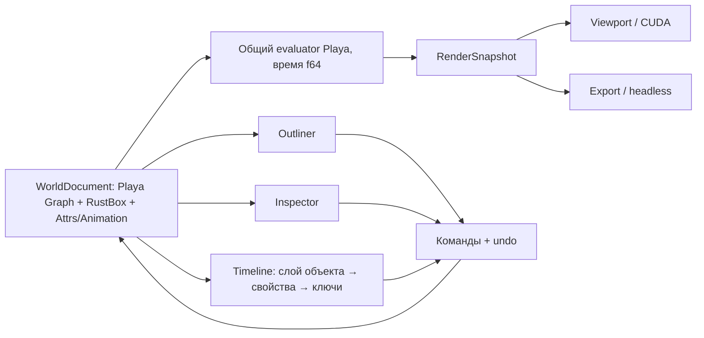

# План: мир объектов на модели Playa

Дата: 2026-10-02. Статус: этапы 1–5 реализованы и проверены.

Фрактал, камера, свет и HDR-окружение становятся узлами одного документа. Outliner показывает иерархию объектов; Timeline показывает те же объекты как слои, раскрывающиеся в свойства и ключи. Inspector редактирует выбранный объект.

## Фактическая система 2026-10-02

Playa подключена через GitHub SSH на commit `6b1c6c7d53522b696f859af400e0b141aaab2ba5`. Локальные репозитории используются для исследования; все Git dependencies должны подключаться через GitHub SSH с закреплённым commit. Последние vendor path dependencies заменены опубликованными SSH revisions camera crates и Standard Surface; точные commits и граница повторной проверки указаны в [плане 1](../../plan1.md).

Постоянная модель находится в [world.rs](../../src/world.rs), панели — в [world_ui.rs](../../src/world_ui.rs). WorldDocument сохраняет Playa `SubnetFile`; runtime `Graph` восстанавливает UUID nodes с `Node.data: RustBox` из box-rs. В узле `gpu` хранит авторитетную базовую конфигурацию для GPU, `host` — Playa Attrs/Animation, `discrete` — JSON-словари значений, `metadata` — произвольный JSON. Для дискретной анимации Playa Step-канал вычисляет индекс словаря; второй evaluator не введён.

`WorldDocument::snapshot(frame: f64)` создаёт временный Scene с массивами объектов, lights и parent-composed affine matrices. CUDA buffers производны от этого снимка. Device buffers и evaluated Scene не становятся постоянными узлами. Preview, экспорт и thumbnails используют общий evaluator.

Сохранённый `bus_slots.layer_order` состоит из UUID и независим от parent/children и wires. UI адресует свойство через UUID + path, ключ — также через `f64` время; отдельные persistent TrackId/KeyId из первоначального проекта не потребовались. Material assignment сохраняет UUID Material-узла. Общие selection и атомарные команды с undo/redo принадлежат WorldEditor.

Solo принято как свойство слоя AE: оно сохраняется в host Attrs и одинаково фильтрует preview/export. Visibility и полуоткрытый span наследуются через parent; lock предка блокирует edit. Selection определяет редактируемый объект и не фильтрует геометрию. Активная камера сохраняет роль при скрытии; её reference radius не зависит от reorder/visibility фракталов. Скрытое HDR-окружение даёт нулевое sky illumination и выключенный background.

Legacy rotation и ключи при миграции меняют знак для Playa conventions, scalar scale становится XYZ. GPU получает полный parent transform, inverse transpose нормалей и консервативный шаг для nonuniform scale. DE iterations задаются каждому Fractal; ray marching и bounce settings задаются миру. HDR/EXR float decode и importance sampling сохранены.

Этапы 1–5 завершены: `cargo check --tests`, release-сборка приложения и полный harness 84/84 прошли. Принудительно холодный export прошёл за 48,70 секунды; реальное окно с Outliner и AE-подобными слоями проверено визуально — см. [проверку](phase-05-validation.md). OIDN с cadence через N samples по образцу squarebob-rs описан в [плане 1](../../plan1.md); его реализация подтверждена release-сборкой и 95 тестами, включая три реальных GPU-теста. После последнего переключения vendor dependencies на SSH повторная release-сборка и все 95 тестов прошли; аудит подтвердил 214 Git packages по SSH без локальных path dependencies.

Ниже сохранён исходный проектный перечень; уточнения состава файлов и формата приведены в разделах «Реализовано» каждого этапа.

## Основа

Берём непосредственно `playa-graph`, `playa-engine::entities::{Attrs, Animation}`, `playa-time` и `playa-coord` на согласованной git revision. Не создаём собственные WorldNode, кривые или второй evaluator. Первый этап проверяет зависимости и сборку. Выделение существующих модулей в lightweight crate внутри Playa допустимо только при доказанном конфликте; старые API сохраняют reexports.

`WorldDocument` владеет авторитетным `SubnetFile`, из которого восстанавливается `Graph`. `Node.data: RustBox` хранит сериализованные Playa Attrs/slots и произвольные key:value metadata. Runtime-кэши и UI-проекции вычисляются из документа.

## Правила документа

- Stable NodeId UUID идентифицирует объект и его слой. Переименование, reparent и reorder не меняют адрес ключа.
- Parent tree, wire topology графа и порядок слоёв — разные отношения. Порядок Timeline не меняет физическую окклюзию.
- Библиотека типов: Fractal, Camera, DirectionalLight, Environment, Group, Material; корень хранит настройки мира. Схема определяет применимость TRS, материала, видимости и анимации.
- Material assignment хранит UUID; миграция может сохранить прежний inline material как default.
- Пользовательские числовые attrs анимируются через динамические descriptors. Неизвестные значения сохраняются. Bool, enum, string и структурные переключения требуют общей дискретной семантики Playa.
- Inspector, Timeline, Outliner и жесты камеры используют общий command/event/undo путь; JSON diff на каждом кадре убирается.
- Полный 3D TRS использует Playa transform conventions и композицию родителей; renderer корректно преобразует нормали и учитывает масштаб.
- Видимость и solo — сохраняемые свойства слоя; lock предотвращает редактирование. Solo одинаково фильтрует preview/export; правила наследования фиксируются тестами.

## Этапы

| Этап | Результат |
|---|---|
| [1. Модель](phase-01-model.md) | Проверенные dependencies, схема и общий evaluator |
| [2. Миграция](phase-02-world-migration.md) | Старые сцены, bookmarks, presets и ключи без потерь |
| [3. UI объектов](phase-03-object-ui.md) | Outliner, Inspector и AE-подобные слои Timeline |
| [4. CUDA-мир](phase-04-cuda-world.md) | Настоящие несколько фракталов, материалы, света и TRS |
| [5. Проверка](phase-05-validation.md) | E2E, миграция, сохранение и parity render/export |

Источники и проверяемые ограничения: [результаты исследования](research/findings.md).

## Значения по умолчанию и границы

Одна активная камера и одно активное HDR-окружение выбираются UUID; Environment-узлов может быть несколько. Новый мир содержит один фрактал, камеру и прежний directional light, а HDR включается после загрузки. Сроки объекта берутся из Playa timing: span полуоткрытый [start, end), вне него объект неактивен одинаково в preview/export. Неактивный parent скрывает descendants; default span обычного объекта покрывает весь мир.

Несколько directional lights входят в эту задачу. Смешивание нескольких HDR и area lights откладываются; UI не предлагает неподдерживаемое освещение.

Прямые Playa dependencies прошли сборку; дискретные attrs используют Step-индексы JSON-словарей, расширения хранятся в данных узлов RustBox. Фактическая миграция rotation и camera reference описана в этапе 2. Итоговые результаты проверок фиксируются в этапе 5.
